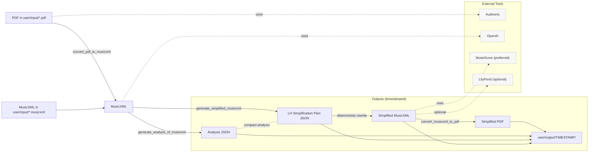

# Architecture / End-to-end flow

The high-level pipeline below mirrors the CLI sub-commands and outputs. GitHub renders this Mermaid diagram directly in the README; update it when commands change.



Optional: validate or render this diagram locally

* Validate syntax in pre-commit: the repo includes a hook that checks the Mermaid block using [scripts/diagram.sh](scripts/diagram.sh).
* Render an SVG for docs/slides

Try it:

```shell
docker run --rm -u "$(id -u):$(id -g)" -v "$PWD":/data -w /data minlag/mermaid-cli:11.10.1 -i ARCHITECTURE.md -o docs/architecture.svg
```
