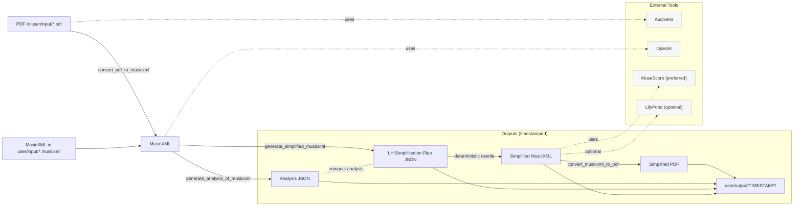

# Piano Learning

## Getting Set Up

Please reference [SETUP.md](SETUP.md) for setup steps.

## Architecture / End-to-end flow

The high-level pipeline below mirrors the CLI sub-commands and outputs. GitHub renders this Mermaid diagram directly in the README; update it when commands change.



Optional: validate or render this diagram locally

* Validate syntax in pre-commit: the repo includes a hook that checks the Mermaid block using [scripts/diagram.sh](scripts/diagram.sh).
* Render an SVG for docs/slides

Try it:

```shell
docker run --rm -u "$(id -u):$(id -g)" -v "$PWD":/data -w /data minlag/mermaid-cli:11.10.1 -i README.md -o docs/architecture.svg
```

## How to Generate a Simplified Sheet

Given a sheet located at `user/input/Difficult_Sheet_Music.pdf`.

### Option A -- One command end-to-end (PDF → simplified PDF)

Run the entire pipeline in one step:

* From PDF using the default `music21` simplifier: `./main.py generate_simplified_pdf --pdf_path user/input/your_file.pdf`
* From MusicXML using the default `music21` simplifier: `./main.py generate_simplified_pdf --musicxml_path user/input/your_file.musicxml`
* From MusicXML using OpenAI via the Responses API background mode: `./main.py generate_simplified_pdf --musicxml_path user/input/your_file.musicxml --simplifier openai`
* From MusicXML using OpenAI via the experimental Agents SDK: `./main.py generate_simplified_pdf --musicxml_path user/input/your_file.musicxml --simplifier openai --use-agent`

Note: Outputs are written to a timestamped directory under `user/output/` unless you pass `--out-dir`.

### Option B -- Advanced: run individual steps

1. Convert a PDF to MusicXML:
    * `python main.py convert_pdf_to_musicxml user/input/Difficult_Sheet_Music.pdf`
1. Analyze a MusicXML file:
    * `python main.py generate_analysis_of_musicxml user/input/Difficult_Sheet_Music.xml`
1. Generate the simplified MusicXML file (automatic or manual for validation):
    * Automatic with `music21` (default): `python main.py generate_simplified_musicxml user/input/Difficult_Sheet_Music.xml`
    * Automatic with OpenAI Responses API background mode: `python main.py generate_simplified_musicxml user/input/Difficult_Sheet_Music.xml --simplifier openai`
    * Automatic with OpenAI Agents SDK (experimental): `python main.py generate_simplified_musicxml user/input/Difficult_Sheet_Music.xml --simplifier openai --use-agent`
    * Manual (validation):
        1. `python main.py generate_simplified_musicxml --simplifier openai --manual user/input/Difficult_Sheet_Music.xml`
        1. This renders the [system prompt](src/piano_learning/resources/system_instructions_for_chatgpt.j2), [user prompt](src/piano_learning/resources/user_prompt_for_chatgpt.j2), simplification-plan schema, and compact analysis.
        1. Save the returned JSON plan and apply it with `python main.py apply_simplification_plan user/input/Difficult_Sheet_Music.xml user/input/Difficult_Sheet_Music_plan.json`.
1. Convert the simplified MusicXML file to PDF:
    * `python main.py convert_musicxml_to_pdf user/input/Difficult_Sheet_Music_simplified.xml`

If you require List commands and help:

* `python main.py -h`
* `python main.py <sub-command> -h`

## Simplifier Backends

The repo currently supports two simplification backends:

* `music21` (default): deterministic local simplification that does not require `OPENAI_API_KEY`
* `openai`: AI-backed LH planning that requires `OPENAI_API_KEY`; local code validates the plan and writes MusicXML

Key rules:

* `--simplifier music21` is the default for both `generate_simplified_musicxml` and `generate_simplified_pdf`.
* `--simplifier openai` uses the OpenAI Responses API in background mode by default.
* `--use-agent` only applies when `--simplifier openai` is selected.
* `--manual` only applies when `--simplifier openai` is selected.
* The old `--music21` flag is still accepted as a backward-compatible alias, but new work should prefer `--simplifier music21`.

OpenAI does not write full MusicXML anymore. It returns a compact left-hand simplification-plan JSON object. The local deterministic rewriter then copies the original score, preserves the right hand and structure, rewrites only the left-hand part, and validates measure parity before returning the simplified MusicXML. Non-`preserve` plan measures must cover the full source measure duration with explicit note/chord/rest events, so gaps and shortened measures are rejected before MusicXML is written.

If you're debugging backend selection in isolation, start here:

```shell
python main.py generate_simplified_musicxml -h
python main.py generate_simplified_musicxml user/input/Your_Score.musicxml
python main.py generate_simplified_musicxml user/input/Your_Score.musicxml --simplifier openai
python main.py generate_simplified_musicxml user/input/Your_Score.musicxml --simplifier openai --manual
python main.py apply_simplification_plan user/input/Your_Score.musicxml user/input/Your_Score_plan.json
```

The selected backend is logged to `user/output/.../piano_learning.log`, which is the quickest way to confirm whether you are exercising `music21`, OpenAI background mode, or the experimental agent path.

## Validating the External Dependencies

This repo makes use of various external tools.

### MuseScore vs. LilyPond

MuseScore is the preferred renderer for PDF output in this project due to better engraving for many scores. The Docker image installs MuseScore and configures a headless Qt environment, so `convert_musicxml_to_pdf` will work with MuseScore out-of-the-box. LilyPond remains available as an optional alternative.

Inside Docker, you can run the end-to-end flow and rely on MuseScore for final PDF generation:

```shell
docker compose run --rm piano-learning python3 main.py generate_simplified_pdf --musicxml_path user/input/Your_Score.musicxml
```

Or run just the MusicXML → PDF step with MuseScore:

```shell
docker compose run --rm piano-learning python3 main.py convert_musicxml_to_pdf user/input/Your_Score.musicxml --convert-with-musescore --overwrite
```

### Debugging Issues with OpenAI

For additional details for validating issues:

* [OpenAI's Observability](https://platform.openai.com/logs)

OpenAI-specific notes:

* You only need `OPENAI_API_KEY` for commands that use `--simplifier openai`.
* The default OpenAI execution path is the Responses API in background mode.
* `--use-agent` is supported as an experimental path for isolated validation only.
* `--manual` renders the plan-generation prompts without calling the API, which is useful when you want to inspect the exact prompt payload independently of local code.
* The OpenAI path saves debug artifacts for the compact analysis, schema, model output, validated plan, and generated MusicXML under the selected output directory.

Run `python main.py generate_simplified_musicxml --simplifier openai --manual user/input/Difficult_Sheet_Music.xml` to generate the prompt files.
