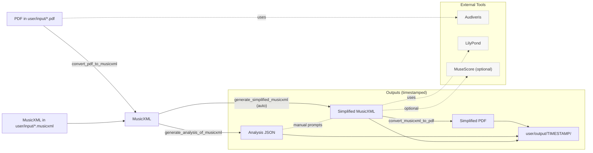

# Piano Learning

## Getting Set Up

Please reference [SETUP.md](SETUP.md) for setup steps.

## Architecture / End-to-end flow

The high-level pipeline below mirrors the CLI sub-commands and outputs. GitHub renders this Mermaid diagram directly in the README; update it when commands change.



Optional: validate or render this diagram locally

* Validate syntax in pre-commit: the repo includes a hook that checks the Mermaid block.
* Render an SVG for docs/slides

Try it:

```shell
docker run --rm -u "$(id -u):$(id -g)" -v "$PWD":/data -w /data minlag/mermaid-cli:11.10.1 -i README.md -o docs/architecture.svg
```

## How to Generate a Simplified Sheet

Given a sheet located at `user/input/Difficult_Sheet_Music.pdf`.

### Option A -- One command end-to-end (PDF → simplified PDF)

Run the entire pipeline in one step:

* From PDF: `./main.py generate_simplified_pdf --pdf_path user/input/your_file.pdf`
* From MusicXML: `./main.py generate_simplified_pdf --musicxml_path user/input/your_file.musicxml`

Note: Outputs are written to a timestamped directory under `user/output/` unless you pass `--out-dir`.

### Option B -- Advanced: run individual steps

1. Convert a PDF to MusicXML:
    * `python main.py convert_pdf_to_musicxml user/input/Difficult_Sheet_Music.pdf`
1. Analyze a MusicXML file:
    * `python main.py generate_analysis_of_musicxml user/input/Difficult_Sheet_Music.xml`
1. Generate the simplified MusicXML file (automatic or manual for validation):
    * Automatic (recommended): `python main.py generate_simplified_musicxml user/input/Difficult_Sheet_Music.xml`
    * Manual (validation):
        1. `python main.py generate_simplified_musicxml --manual user/input/Difficult_Sheet_Music.xml`
        1. This renders the [system prompt](src/piano_learning/resources/system_instructions_for_chatgpt.j2) and the [user prompt](src/piano_learning/resources/user_prompt_for_chatgpt.j2).
        1. Attach `user/input/Difficult_Sheet_Music.xml` and `user/input/Difficult_Sheet_Music_analysis.json` in ChatGPT.
        1. Save the generated simplified file as `user/input/Difficult_Sheet_Music_simplified.xml` (re-run if needed).
1. Convert the simplified MusicXML file to PDF:
    * `python main.py convert_musicxml_to_pdf user/input/Difficult_Sheet_Music_simplified.xml`

If you require List commands and help:

* `python main.py -h`
* `python main.py <sub-command> -h`

## Validating the External Dependencies

This repo makes use of various external tools.

### Debugging Issues with OpenAI

For additional details for validating issues:

* [OpenAI's Observability](https://platform.openai.com/logs)

Moreover, for validating the agent, use the `--manual` argument to output the prompts to paste into ChatGPT.
Run `python main.py generate_simplified_musicxml --manual user/input/Difficult_Sheet_Music.xml` to generate the prompt.
