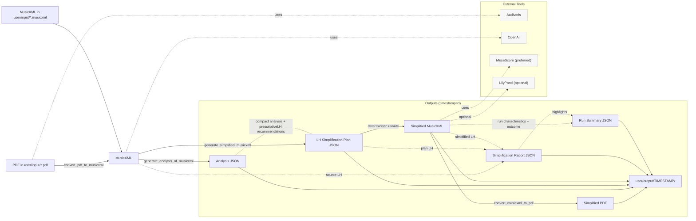

# Architecture / End-to-end flow

The high-level pipeline below mirrors the CLI sub-commands and outputs. GitHub renders this Mermaid diagram directly in the README; update it when commands change.



## Instrumentation

Every simplification run (both the OpenAI and music21 backends) also emits a
`<stem>_simplification_report.json` alongside its other outputs. The report quantifies how much
the left hand actually changed -- measures preserved vs. changed, `pctChanged`, a texture
histogram, LH note-count delta, and (for the AI path) how many `prescriptiveLH` recommendations
the model followed vs. overrode. An `unmodifiedFlag` is logged as a warning when a run comes back
nearly unchanged. The `compare_runs` sub-command diffs two runs' reports so regressions in
simplification strength are visible run over run.

## Observability artifacts

Each run also leaves a standardized, flat set of debugging artifacts and a single
`run_summary.json` indexing what was sent to the model, what came back, what failed validation,
and what was finally written. The OpenAI path additionally saves prompt inputs, the raw model
output and reasoning (written *before* validation, so a failed run is still inspectable), and a
`validation_report.json`. Naming and layout are owned by
[`src/piano_learning/utils/run_artifacts.py`](../src/piano_learning/utils/run_artifacts.py) and
documented in full in [DEBUGGING.md](DEBUGGING.md).

Optional: validate or render this diagram locally

* Validate syntax in pre-commit: the repo includes a hook that checks the Mermaid block using [scripts/diagram.sh](../scripts/diagram.sh).
* Render an SVG for docs/slides

Try it:

```shell
docker run --rm -u "$(id -u):$(id -g)" -v "$PWD":/data -w /data minlag/mermaid-cli:11.10.1 -i docs/ARCHITECTURE.md -o docs/architecture.svg
```
